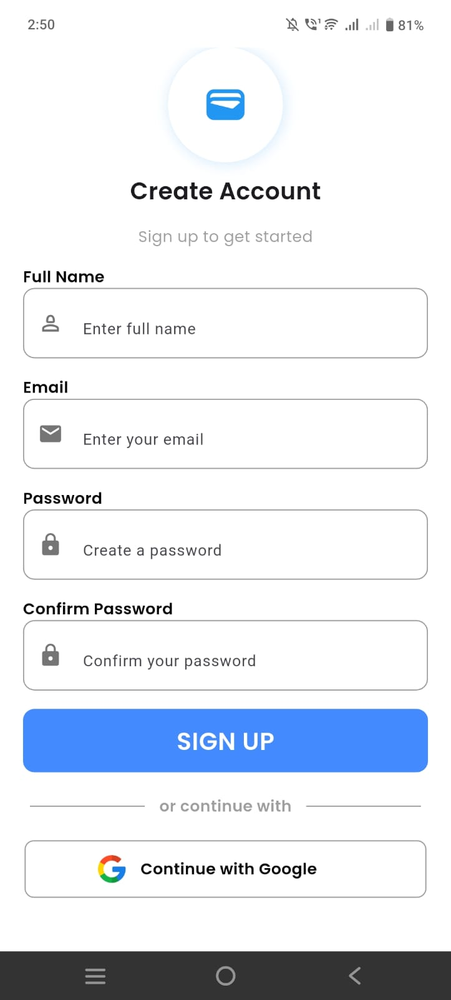

# 💰 MyExpenseTracker App

A modern **Flutter Expense Tracker Application** built using **Firebase** and clean architecture principles.  
This app helps users track their income, expenses, and remaining balance in real time with a clean and responsive UI.

---

# 🚀 Features

- 🔐 Firebase Authentication (Login / Signup / Logout)
- 💵 Set Initial Balance
- ➕ Add Expenses
- ✏️ Update Expenses
- 🗑 Delete Expenses
- 📊 Real-time Remaining Balance Calculation
- 📅 Expense Date Tracking
- 🧾 Category-based Expense Management
- 🔄 Live Firestore Updates (Stream-based UI)
- 📱 Clean & Responsive UI Design

---

# 📸 App Screenshots

## 🏠 Home Screen

## 🔐 Login Screen

## 🆕 Signup Screen

## 💵 Set Balance Screen

## ➕ Add Expense Screen

## ✏️ Update Expense Screen

## 🗑 Delete Expense

## 🧑 Profile Screen

## 🔁 Forgot Password Screen

---

# 🛠 Tech Stack

- Flutter (Latest Stable)
- Dart
- Firebase Authentication
- Cloud Firestore
- Provider (State Management)
- Google Fonts
- Intl Package

---

# 🏗 Project Architecture
lib/
│
├── features/
│ ├── auth/
│ ├── expenses/
│ ├── profile/
│ └── widgets/
│
├── services/
├── provider/
├── model/
└── main.dart

# 🔥 Firestore Structure
user
   └── uid
        ├── name
        ├── email
        ├── initialBalance
        │
        └── expense
              ├── title
              ├── amount
              ├── note
              └── createdAt

👨‍💻 Developer
Developed by Raees Khan
GitHub:
https://github.com/raeeskhan371/MyExpenseTracker_App
